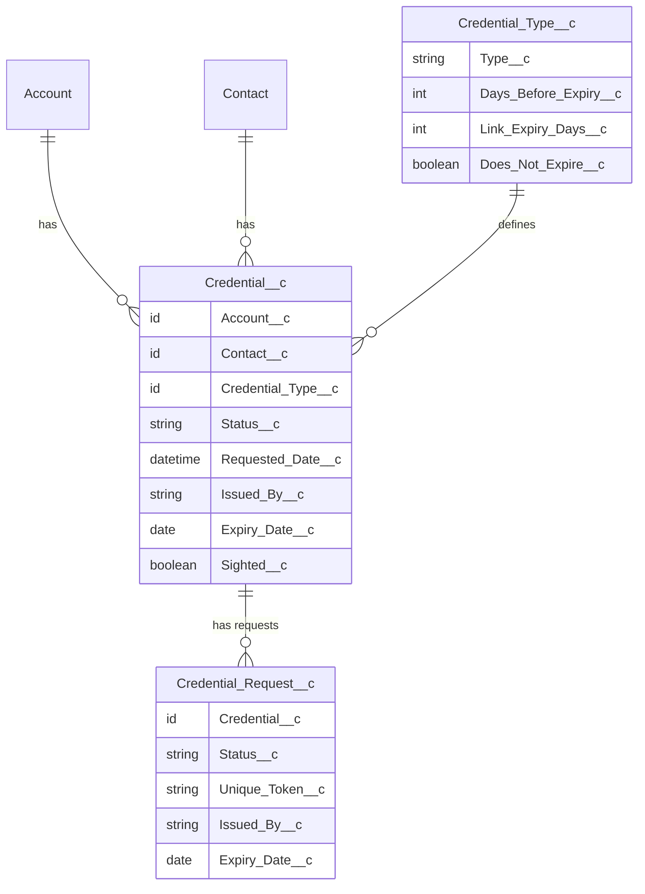

# Data Model

## Object Overview

The data model has three custom objects. `Credential_Type__c` is the master lookup defining document categories. `Credential__c` is the transaction record that ties a specific credential requirement to a person or organisation and tracks it through its lifecycle. `Credential_Request__c` is the staging object that captures each submission attempt, holding the unique token and volunteer-submitted data pending admin review.



---

## Credential Type (`Credential_Type__c`)

Defines the global configuration for a category of credential document. Created and maintained by admins. One record per document category; not per volunteer.

| Field Label | API Name | Data Type | Notes |
|---|---|---|---|
| Name | Name | Auto-Number | Format: `CT-{0000}`. System-generated identifier. |
| Credential Type | Type__c | Text / Picklist | The document category label shown on the form. e.g. "Police Check", "Driver's Licence". |
| Days Before Expiry | Days_Before_Expiry__c | Number | Lead time for renewal notifications. e.g. 30 means notify 30 days before the credential expires. |
| Link Expiry Days | Link_Expiry_Days__c | Number | Number of days the submission URL remains usable after status moves to "Requested". e.g. 7. |
| Does Not Expire | Does_Not_Expire__c | Checkbox | When true, the Expiry Date field is hidden on the volunteer form. Used for one-time checks. |

**Business rules:**
- `Link_Expiry_Days__c` must be a positive integer. A value of 0 would make every link immediately expired.
- `Days_Before_Expiry__c` is used by the nightly Scheduled Flow to trigger renewal alerts.

---

## Credential (`Credential__c`)

The core transaction object. One record per credential requirement per person or organisation. Created by an admin, then updated by the volunteer via the Intake Flow, and finally verified and activated by an admin.

| Field Label | API Name | Data Type | Notes |
|---|---|---|---|
| Name | Name | Auto-Number | Format: `CR-{0000}`. System-generated identifier. |
| Account | Account__c | Lookup (Account) | Optional. Links to an organisation. Mutually inclusive with Contact - at least one should be populated. |
| Contact | Contact__c | Lookup (Contact) | Optional. Links to an individual. |
| Credential Type | Credential_Type__c | Lookup (Credential_Type__c) | Required. Drives the form label, link expiry window, and expiry notification logic. |
| Status | Status__c | Picklist | See lifecycle below. |
| Requested Date | Requested_Date__c | Date/Time | Stamped by a Before Update Flow when Status moves to "Requested". Records when the submission window opened. |
| Issued By | Issued_By__c | Text | Provided by the volunteer via the intake form. The name of the issuing authority. |
| Expiry Date | Expiry_Date__c | Date | Provided by the volunteer. Not shown on the form when `Does_Not_Expire__c` is TRUE on the parent Credential Type. |
| Does Not Expire | Does_Not_Expire__c | Checkbox | Mirrors the value from the linked Credential Type. When true, the Expiry Date field is hidden on the submission form and `Expiry_Date__c` will be blank on the record. |
| Sighted | Sighted__c | Checkbox | Admin-only. Set to TRUE automatically by the `Credential_Request_Approval` flow when a Credential Request is approved. Must be TRUE before Status can be set to Active. Field History Tracking enabled. |

### Status Lifecycle

```
Draft -> Requested -> Under Review -> Active
                                   -> Expired  (set by Scheduled Flow or manual)
```

| Status | Meaning |
|---|---|
| Draft | Record created but submission not yet requested. |
| Requested | Admin has sent the submission link to the volunteer. `Requested_Date__c` is stamped at this transition. Link is now active. |
| Under Review | Volunteer has submitted their document via the form. Awaiting admin review. |
| Active | Admin has approved the Credential Request. The `Credential_Request_Approval` flow sets `Sighted__c = true` and `Status__c = Active` simultaneously. Requires `Sighted__c = TRUE` (enforced by validation rule). |
| Expired | Credential has passed its expiry date. Set by the nightly Scheduled Flow. |
| Pending | Reserved for future use - e.g. awaiting a third-party verification step. |

### Validation Rules

| Rule | Logic | Purpose |
|---|---|---|
| Block activation without sighting | `ISPICKVAL(Status__c, "Active") AND NOT(Sighted__c)` | Prevents activating a credential without admin verification. In practice, the `Credential_Request_Approval` flow always sets Sighted and Status together, so this rule acts as a safety net against manual edits. |

### Deprecated Fields (pending cleanup)

The following fields exist on `Credential__c` from an earlier version of the design but are no longer used. They cannot be deleted yet because the legacy `Credential_Intake_Form` screen flow references `Unique_Token__c`. Once that flow is updated to query `Credential_Request__c`, these fields can be removed.

| Field | Reason deprecated |
|---|---|
| `Unique_Token__c` | Token moved to `Credential_Request__c`. |
| `Submission_Link__c` | Link formula moved to `Credential_Request__c`. |

See `docs/todo.md` for the cleanup task.

### Key Relationships

- A Credential record must have either a Contact or an Account (or both). The system does not enforce this declaratively today - add a validation rule if this constraint must be hard-enforced (see `docs/todo.md`).
- Files uploaded by the volunteer are stored as `ContentDocument` records linked to the Credential Request via `ContentDocumentLink`. Files stay on the Credential Request for audit purposes and are never moved to the Credential record.

---

## Credential Request (`Credential_Request__c`)

Staging object for volunteer credential submissions awaiting admin review. The Intake Flow creates one record per submission, capturing the volunteer-entered data here rather than writing it directly to `Credential__c`. This gives admins a review gate before any submission data reaches the authoritative credential record.

OWD is **ReadWrite** - internal users can read and update all requests. Volunteers access only via the System Mode Intake Flow and cannot query this object directly.

| Field Label | API Name | Data Type | Notes |
|---|---|---|---|
| Name | Name | Auto-Number | Format: `CRQ-{0000}`. System-generated identifier. |
| Credential | Credential__c | Lookup (Credential__c) | Required. Links to the parent credential. deleteConstraint: Restrict - a Credential cannot be deleted while requests are linked. |
| Status | Status__c | Picklist | See status lifecycle below. |
| Unique Token | Unique_Token__c | Text (36) | UUID generated by the `Credential_Request_Creation` flow. The token is embedded in the submission URL. Each request has its own token, so each link is independent. |
| Submission Link | Submission_Link__c | Formula (Text) | `[Site_URL] + "/s/submit?id=" + Unique_Token__c`. Displayed in the Highlights Panel so admins can copy and send to the volunteer. |
| Issued By | Issued_By__c | Text (255) | Issuing authority name entered by the volunteer on submit. Copied to `Credential__c.Issued_By__c` on approval. Blank until submitted. |
| Expiry Date | Expiry_Date__c | Date | Document expiry date entered by the volunteer. Blank when the parent Credential Type has `Does_Not_Expire__c = true`. Copied to `Credential__c.Expiry_Date__c` on approval. |

### Status Lifecycle

```
Awaiting Submission -> Pending Review -> Approved
                                      -> Rejected
```

| Status | Meaning |
|---|---|
| Awaiting Submission | Set by the `Credential_Request_Creation` flow when the request is created. The volunteer has been sent the link but has not yet submitted. |
| Pending Review | Set by the Apex controller (or Intake Flow) when the volunteer submits. Awaiting admin review. |
| Approved | Admin has reviewed the submission and accepts it. Triggers the `Credential_Request_Approval` flow which copies `Issued_By__c` and `Expiry_Date__c` to the linked `Credential__c`, sets `Sighted__c = true`, and sets `Status__c = Active`. |
| Rejected | Admin has reviewed the submission and rejects it. No automated action. Record is retained for audit. |

### Key Relationships

- Each Credential Request belongs to exactly one Credential record via `Credential__c` (required Lookup).
- A Credential may have multiple Credential Requests over its lifetime (e.g. if a submission is rejected and a new link is issued).
- Files uploaded by the volunteer attach to the Credential Request (not the Credential). They remain here permanently as an audit trail. See `docs/decisions/use-staging-object-for-intake.md`.
