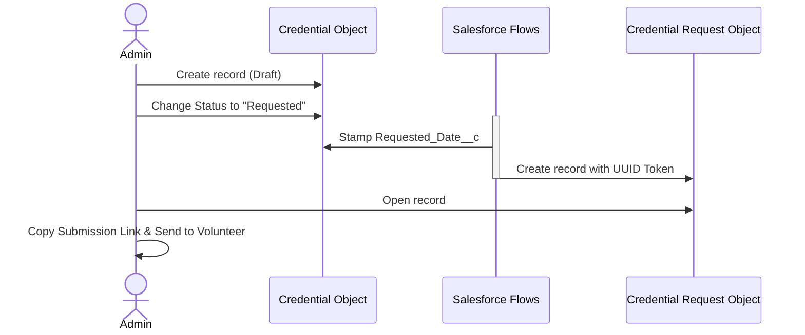
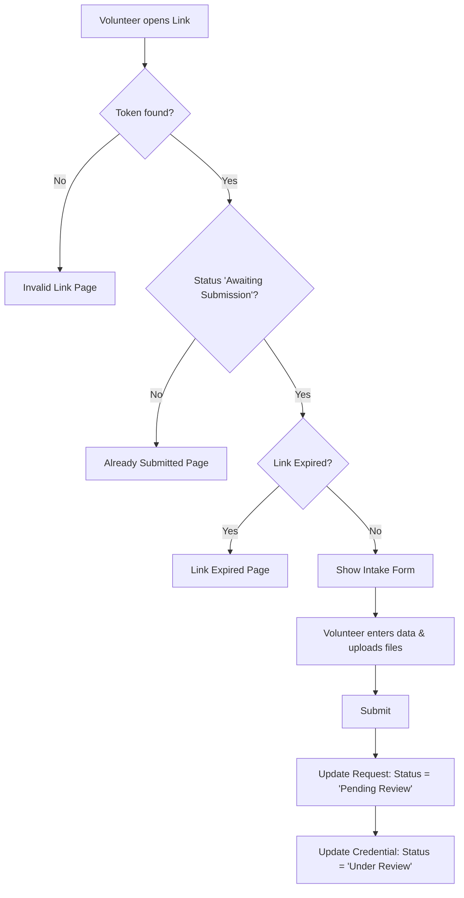
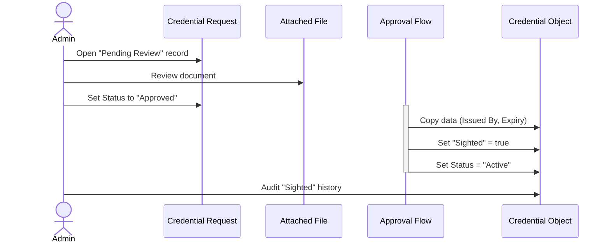

# Solution Overview

## Problem Statement

Volunteer-based organisations need to collect, verify, and track credentials (e.g. Police Checks, Working with Children Checks, Driver's Licences) from their volunteers. Historically this is handled through email and spreadsheets, creating a fragmented audit trail and no clear ownership of the verification process.

This solution provides a secure, admin-controlled intake process where:
- An admin creates a Credential record in Salesforce and sends the volunteer a unique submission link
- The volunteer clicks the link, fills in a simple form, and uploads their document - no Salesforce login required
- The admin reviews the uploaded file and approves the Credential Request, which automatically activates the credential

The system enforces time-bound access (the link expires), prevents URL guessing (IDOR protection via GUID token), and keeps all credential data inside Salesforce under private OWD.

---

## Approach

The solution is built on the Salesforce platform using a combination of declarative tooling and Apex. No external services are required. Key choices:

- **Screen Flow in System Mode** acts as the data proxy for the original public-facing form. The Guest User Profile has zero object permissions; the flow performs all reads and writes using system context. A **Lightning Web Component (LWC)** alternative provides the same capability for LWR-based Experience Cloud sites. Both coexist; neither replaces the other.
- **Experience Cloud** hosts the public form page on an unauthenticated site. The flow or LWC component is embedded on this page.
- **GUID tokens** on each `Credential_Request__c` record serve as the access key. The submission URL contains only the token; no Salesforce record ID is ever exposed in the URL.
- **Link expiry** is enforced by comparing today's date against `Credential_Request__c.CreatedDate + Link_Expiry_Days__c`. The request is created at the moment the Credential status moves to Requested, so `CreatedDate` marks the precise start of the submission window.
- **Staging object** (`Credential_Request__c`) separates volunteer-submitted intake data from the authoritative Credential record. Unverified data lands on the request; an admin review gate controls when it is promoted to the Credential.

See `docs/decisions/` for the rationale behind each of these choices.

---

## Key Components

| Component | What it does |
|---|---|
| **Credential Type** object | Master list of document types (e.g. Police Check). Defines expiry notification lead time and link expiry window. |
| **Credential** object | The transaction record linking a person (Contact or Account) to a required document. Tracks status throughout its lifecycle. |
| **Credential Request** object | Staging record created when a submission is requested. Holds the GUID token and the volunteer-submitted data. One request per link issued. |
| **Request Creation Flow** | Record-triggered After Update flow on Credential. When status moves to Requested, creates a `Credential_Request__c` with a unique UUID token (via `GenerateUUID` Apex action) and Status = Awaiting Submission. |
| **Requested Date Flow** | Record-triggered Before Update flow that stamps `Requested_Date__c` on the Credential when status moves to Requested. |
| **Request Approval Flow** | Record-triggered After Update flow on Credential Request. When Status moves to Approved, copies Issued By and Expiry Date to the linked Credential and sets its Status to Active with Sighted = true. |
| **Intake Screen Flow** | The original public-facing form. Validates the token, checks expiry, collects data, and updates the Credential Request. Runs in System Mode Without Sharing. |
| **credentialSubmissionForm LWC** | Alternative public-facing form for LWR Experience Cloud sites. Same behaviour as the Screen Flow - reads token from URL, validates via Apex, collects input, uploads files as base64. |
| **CredentialSubmissionController** | Apex class (without sharing) backing the LWC. Three methods: `getCredentialByToken`, `submitCredential`, `uploadFile`. Acts as the privileged data proxy for the guest user. |
| **GenerateUUID** | Apex invocable action called by the Request Creation Flow to generate a cryptographically random GUID (128-bit Crypto.generateAesKey). |
| **Experience Cloud Site** | Hosts the Intake Flow or LWC on a public, unauthenticated URL. Guest User Profile is locked down to flow execution only. |
| **Scheduled Expiry Flow** | Nightly flow that checks credential expiry dates and updates status to Expired as needed. **Not yet built** - see `docs/todo.md`. |
| **Validation Rule** | Prevents a Credential from being set to Active unless `Sighted__c` is TRUE. Enforces the verification step. |

---

## Key Flows

### Admin Requests a Credential Submission

1. Admin creates a Credential record, linking it to a Contact or Account and selecting a Credential Type.
2. Admin changes Status to Requested. The Before Update flow stamps `Requested_Date__c`. The After Update flow creates a `Credential_Request__c` with a unique GUID token and Status = Awaiting Submission.
3. Admin opens the new Credential Request from the Credential Requests related list on the Credential record.
4. Admin copies the `Submission_Link__c` formula field from the Credential Request highlights panel and sends it to the volunteer (email, SMS, etc.).

### Volunteer Submits a Credential

1. Volunteer receives the link and opens it in a browser. The Experience Cloud site loads.
2. The Intake Screen Flow (or LWC) receives the `id` token from the URL query parameter.
3. The form looks up the `Credential_Request__c` by token and evaluates three checks:
   - Is the request found? (Invalid Link path if not)
   - Is the request Status still Awaiting Submission? (Already Submitted path if not)
   - Has the link expired? (Link Expired path if yes - based on `CreatedDate + Link_Expiry_Days__c`)
4. If all checks pass, the volunteer sees the intake form. They enter their issuer details, expiry date (if applicable), and upload their document (.pdf, .jpg, or .png).
5. On submission, the request is updated to Status = Pending Review with the volunteer-entered values. The Credential status moves to Under Review. Uploaded files attach to the Credential Request record.

### Admin Reviews and Activates

1. Admin receives notification (or monitors the queue via list view) and opens the Credential record.
2. Admin navigates to the Credential Requests related list and opens the request with Status = Pending Review.
3. Admin reviews the Issued By and Expiry Date values and opens the attached file from the Files related list on the Credential Request.
4. Admin changes the Credential Request Status to Approved.
5. The Request Approval Flow fires automatically: copies Issued By and Expiry Date to the linked Credential, sets Sighted = true, and sets Credential Status to Active.
6. Field History Tracking on `Sighted__c` provides an audit trail of the verification action.

If the document is not acceptable, the admin sets the Credential Request Status to Rejected. The rejected request is retained for audit. The admin then sets the Credential Status back to Requested to issue a fresh link.

---

## What This Solution Does Not Do

- **Does not authenticate volunteers** - the form is intentionally public and access-controlled via token only
- **Does not send the submission link automatically** - the admin copies and distributes the link manually
- **Does not support credential types that require multiple documents** in a single submission (see `docs/todo.md`)
- **Does not integrate with external verification services** (e.g. third-party background check providers) - see `docs/todo.md` for planned future capability
- **Does not provide a volunteer-facing portal** for viewing their own submission history
- **Does not send expiry reminders automatically** - the Scheduled Expiry Flow has not yet been built (see `docs/todo.md`)

---

## Related Documentation

- [Architecture](architecture.md) - component structure and data flow
- [Data Model](data-model.md) - object schema and field reference
- [Security](security.md) - access control model and trust boundaries
- [Implementation Plan](implementation-plan.md) - phased build plan and current status
- [User Guide](user-guide.md) - guide for admins and volunteers
- [Manual Test Plan](manual-test-plan.md) - test scenarios for QA
- [Decisions](decisions/) - rationale for key design choices
